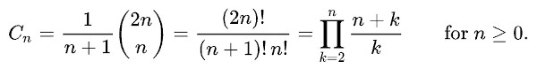

# Unique Binary Search Trees
#### Description

Given an integer `n`, find how many structually unique BSTs (binary search trees) which store values `1 to n` exist.

#### Example

Input: `3`

Output `5`

Explanation:

```
Unique BSTs

1        1       2       3       3
 \        \     / \     /       /
  2        3   1   3   1       2
   \      /             \     /
    3    2               2   1
```

#### How to Solve

This is a Catalan number problem. The Catalan numbers are sequence of integers in the area of the combinatorial mathematics.
Wikipedia has details of [Catalan Number](https://en.wikipedia.org/wiki/Catalan_number). As in the explanation in Wikipedia, the Catalan numbers can be calculated by:



The first solution uses the formula above.

The second solution uses the recursive approach which is described by:


#### Solution 1

- Python

```python
class CatalanNumber:
    def numTrees(self, n: int) -> int:
        count = 1
        for i in range(1, n+1):
            count *= (n + i) / i
        return round(count / (n+1))
```

#### Complexity 1

- Time: `O(n)`
- Space: `O(1)`

#### Solution 2

- Python

```python
class CatalanNumber:
    def numTrees(self, n: int) -> int:
        memo = {}
        memo[0] = 1
        memo[1] = 1
        
        def catalan(n):
            if n in memo: return memo[n]
            memo[n] = 0
            for i in range(n+1):
                memo[n] += catalan(i) * catalan(n-i-1)
            return memo[n]

        return catalan(n)
```

#### Complexity 2

- Time: `O(n^2)`
- Space: `O(n)`